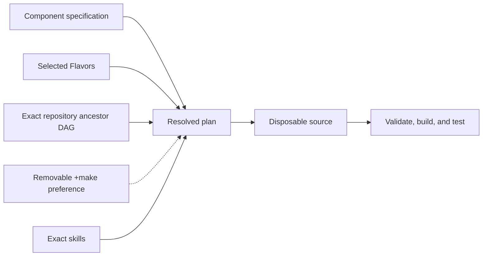

# Project guide

LeRTX is a digital-twin application for LeRobot devices on Linux and Windows
NVIDIA GPU machines. The first milestones establish a Literate AI harness and a
running OVRTX / OVStage viewport with Newton physics.

See the [runtime contract](architecture/runtime.md) for integration boundaries
and the required hardware acceptance evidence.
The [NVIDIA methodology](architecture/nvidia-methodology.md) guides native
viewport interactions, USD robot assets and simulation validation.
The [configuration contract](architecture/configuration.md) defines LLM defaults,
credential handling, and application settings behavior.
The [digital-twin contract](architecture/digital-twin.md) defines milestone-three
photo reconstruction and measurement uncertainty, plus separately scoped
follow-on read-only SO-101 telemetry.

Start with [getting started](user/getting-started.md) for installation and usage.
See [hardware controls](user/hardware.md) for USB connection, calibration, manual
movement and measured physical-to-virtual bindings.
See [active work](roadmap/active-work.md) for current development status.

## Development

This project is built with [Literate AI](https://github.com/NVIDIA-dev/literate-ai).
The [framework flow](user/framework-flow.md) explains the specification-led lifecycle,
and the [project map](user/project-layout.md) identifies the authority for a change.

See [readable specifications](user/specifications.md),
[models and generation](user/models-and-generation.md),
[private test matrices](user/test-matrix.md),
[security](user/security.md), [skill boundaries](architecture/skills.md), and the
[authority learning loop](architecture/authority-learning-loop.md), the
[mission-specification map](architecture/mission-specification-composition.md), and the
[traceability rule](architecture/design-traceability.md) when those concerns apply.

Initialize from an organization or product repository with
`litai init PATH --from URL[#REVISION]`. Literate AI resolves every ancestor without
executing repository code, then records exact commits and inherited catalog provenance.
Use `litai update` to re-resolve that chain and `litai reparent URL|none` to review an
explicit parent change.
