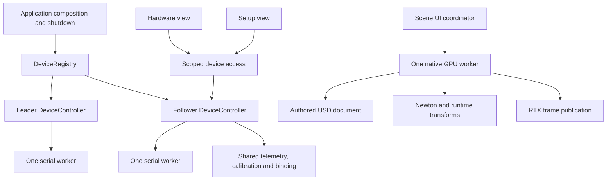

# LeRTX application architecture review

Reviewed 2026-10-05 against main 29ddfdf and the device-controller/navigation changes in this review. Scope: application composition, desktop controls, USB ownership, calibration, rendering/simulation, authored documents, configuration, external services, packaging and verification. This is a source and boundary review with targeted execution, not a claim that every feature or physical arm has been requalified.

The strongest existing boundaries are the independent serial worker, the single native/GPU worker, authored USD separated from runtime poses, and portable validation/math modules. The principal defect is that application coordination grew inside Qt widgets. Windows have been used as resource owners, service locators and navigation state at once. Retain the working workers and domain algorithms; move orchestration into explicit services incrementally.

## Findings, in priority order

| Priority | Finding and concrete evidence | Disposition |
|---|---|---|
| P1 | `setup_ui.advance` and `hardware_ui.__init__` independently constructed `HardwareSession`; the `_PORTS` guard then rejected a second view of the same arm. `MainWindow._hardware_windows` was also consulted as the device registry. | Fixed in this change: application-owned `DeviceRegistry`, one `DeviceController` per canonical port/attachment, scoped `DeviceAccess` objects. |
| P1 | Sharing a raw session alone would let two widget timers overwrite heartbeat/held-motion state, let closing one view terminate another's calibration, and allow conflicting manual/calibration writes. | Fixed at the controller boundary: one writer, shared snapshots, exclusive setup access, observer command rejection, owner-only heartbeat and cleanup acknowledgment before handoff. Pending engage/engaged motors block setup takeover with explicit feedback. |
| P1 | Calibration and virtual binding lived in hardware widgets and setup transferred a session through a factory lambda. A second panel could retain stale calibration identity. | Moved calibration/binding to the shared device model; completed setup acquires/reuses the hardware view and releases its setup access. |
| P1 | CI in `.github/workflows/startup.yml` runs `verification/test_desktop_manage.py`; green PR checks do not exercise controller/wizard/GPU behavior. | Remains a release gate gap. Add emulator/controller and Qt jobs with pinned dependencies, then native RTX qualification on supported workers. Local emulator and Qt results are evidence for this change only. |
| P2 | `ui.py` combines settings, inspector, scene commands, device windows, frame scheduling, persistence and application shutdown in one roughly 1,200-line factory. Child widgets access `_ready`, `_pending`, `_command`, and `worker` directly. | Partially addressed through injected device registry and public hardware lifetime API. Next extract application/scene coordinator interfaces; do not rename all files without changing ownership. |
| P2 | `setup_ui.py` combines widget construction, eleven-step workflow, serial commands, calibration file I/O, ownership handoff and live preview scheduling. Step numbers and `pending` flags are implicit state transitions. | Navigation and ownership transitions repaired here. Next extract a typed `SetupFlow` state machine whose events produce view state and explicit effects; retain `JointSweep` and `RangeCapture`. |
| P2 | `hardware_ui.py` and `setup_ui.py` separately map telemetry, schedule native publications, track generations and stale frames. Each knows the main window's private rendering queue. | Next introduce a physical-twin presenter, consuming device observations and an explicit scene-command interface. Test cancellation, freshness, role switching and simultaneous leader/follower feeds before switching both views. |
| P2 | The RTX companion and main viewport receive the same native frame stream and use the same camera/scene worker. Separate windows therefore do not imply independent view/camera ownership. | Keep current behavior explicit. If independent cameras are required, add view IDs/render products to the existing single GPU owner, not one renderer per window. |
| P2 | Hardware/setup panels lacked explicit parent navigation; diagram visibility depended on a checkbox. Back to arm/reference selection was unavailable during early wizard stages. | Fixed: persistent diagram, named parent buttons, earlier-step Back actions, verified register restoration before revisiting reference, and safe return to selection. |
| P2 | Window shutdown began before the main window's discard confirmation completed. Canceling document close could still close device views. | Moved physical-service shutdown into the accepted application-close path. Application finalization independently shuts down the registry as an exception fallback. |
| P3 | UI factories define nested classes, capture large owner objects, use dense semicolon statements and exchange loosely shaped dictionaries. This makes dependencies and state invariants hard to inspect. | New controller classes are module-level and Qt-independent. Adopt explicit protocols, enums and snapshot dataclasses at extracted boundaries; apply formatting to touched modules separately from behavioral rewrites. Nested classes/dictionaries are not defects by themselves. |
| P3 | `ConnectionProbe` is reused for discovery, credentials and reconstruction; background exceptions collapse to `service_failure`, limiting diagnostic detail. | Preserve bounded asynchronous requests and cancellation tickets. Add structured diagnostic causes and correlation IDs while keeping credentials out of logs. |

The review also found that setup defaulted to the first discovered port for both
roles. Setup now preselects the saved attachment when discovery completes or the
role changes; a regression test verifies distinct leader/follower assignments.

## Current ownership after this repair

A view owns its access, not the port. Read observers cannot submit commands or refresh another controller's heartbeat. Setup acquires exclusive control with motors off; it does not implicitly engage or release motors. Closing an observer only detaches it. Closing the controlling access runs existing stop/register restoration before handing control to another view. Last-access close and application exit close the serial worker. Application services remain on the UI thread; the serial worker retains exclusive bus access and lock-protected snapshots. This is an explicit concurrency contract, not a generally thread-safe registry.

## Subsystem review

| Area | Existing strengths | Next boundary to improve |
|---|---|---|
| Composition/startup (`app`, `desktop_entry`, `host`, `manage.py`) | Portable command dispatch, explicit host support, isolated dependency setup and startup recovery. | Continue injecting application services at composition; keep process cleanup independent of window visibility. |
| Device discovery/persistence (`devices`, `usb_bus`) | Immutable candidate identity, ambiguity checks, canonical port keys, attachment verification, restricted writes and bounded transport. | Route all consumers through registry; retain OS/serial guard as defense against other processes. |
| Device worker (`hardware`) | Bounded queue, stale-sample checks, explicit enable confirmation path, held-motion heartbeat, stop epoch, torque-off and calibration recovery. | Introduce typed command outcomes/events so UI need not infer acknowledgment from several snapshot fields. Do not move bus work to Qt. |
| Calibration (`setup_calibration`, `hardware_calibration`, `joint_binding`) | Separable sweep logic, per-joint reference data, validated identities/ranges and explicit mapping. | Extract orchestration from wizard; preserve motor writes, backup/recovery and final review as transaction boundaries. |
| Rendering/simulation (`scene`, `runtime`, `physics`, `simulation`) | Single GPU owner, bounded command queue, authored/runtime separation, explicit timestep policy, freshness checks and hardware-role exclusion from simulation. | Typed scene service, explicit view identity and common physical-pose presentation. |
| Documents/assets (`document`, `assets`, `robot`, resources) | Private authored layers, local asset validation, atomic saves, pinned model provenance and explicit articulated-link constraints. | Retain these boundaries; avoid a generic repository abstraction that obscures USD behavior. |
| UI (`ui`, `robot_ui`, `viewport_ui`, setup/hardware/device panels) | Useful controls and interaction math already extracted; role badges and readable identity are shared. | Navigation coordinator and view models; widgets render state and emit intent instead of owning workers. |
| Configuration/persistence (`config`, `desktop_state`, `robot_poses`) | Validation, atomic persistence and credential handling are separate from widgets. | Explicit stores injected into workflows, with profile changes published as state updates. |
| External reconstruction (`transport`, `photo`, `reconstruction`, `photo_ui`) | Request validation, cooperative cancellation, bounded response schema and draft scene construction. | Preserve service/UI separation, improve error diagnostics and replace shared generic dictionaries with typed outcomes. |
| Verification/delivery | Serial emulator, real Qt flows, native RTX tests, provenance/lock checks and reproducible launch target exist. | Make behavioral suites PR gates. Formal application admission receipt remains stale and physical-arm acceptance remains a separate obligation. |

## Ordered follow-up plan

1. Land shared device ownership and navigation with simultaneous-view regression coverage. This review's implementation addresses the reproducible port contention.
2. Extract `SetupFlow` and a navigation coordinator. Acceptance: every forward/back/cancel transition tested independently of Qt, then a smaller set of rendered UI checks.
3. Extract a physical-twin presenter and scene interface. Acceptance: both device feeds, queued stale samples, view closure/reopen, renderer backlog and independent camera requirements explicitly tested.
4. Split settings/inspector/main-window construction into ordinary module-level widgets receiving narrow dependencies. Acceptance: unchanged persisted settings, document discard behavior and shortcut navigation.
5. Add typed commands/snapshots at service boundaries, structured diagnostics and CI lanes for portable domain, emulator, Qt and native RTX checks. Refresh formal application admission separately.

Do not combine all five steps into an unreviewable rewrite. The remaining work is architectural debt, not evidence that the existing kinematics, GPU renderer or transport should be replaced.

## Verification of this repair

The controller tests use the real HardwareSession and Feetech SDK with a byte-stream serial emulator. They cover shared port acquisition, conflicting identities, pending engage rejection, observer heartbeat isolation, calibration cancellation/recovery, observer closure and application shutdown. Qt tests cover an already-open hardware panel entering setup, explicit ownership feedback, persistent diagram visibility, early Back navigation and completed setup handoff. Native Windows screenshots verify the diagram/layout. No physical motors are actuated by this verification. Results are recorded with the final change evidence; CI startup checks alone do not qualify physical coupling.
