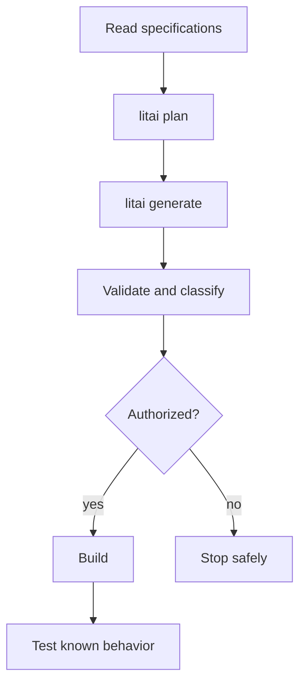

# Framework flow

[Project guide](../README.md) → framework flow

LeRTX currently binds to the reviewed local Python-wheel admission patch at
`0449e10c3a487ae21c4f606d69ee416dd853056f`. Use
`_build/local-litai-0449/venv/bin/litai` from the project root for lifecycle commands.
This is a non-editable, project-local wheel installation; global Litai is unchanged.
The reviewed transition plan is retained in
`verification/shared-wheel-rebind-plan.json`. The previous environment and plan
are retained. Rebinding does not accept generated
source or refresh test receipts: a new rebuild and acceptance run are required.

The desktop's Linux native candidate uses `--target linux` with
`--flavor=-flavor://literate-ai/os-macos` and
`--flavor=+flavor://lertx/desktop-linux`. This project-owned target includes the
observed CPython environment and exact verified dependency-lock data. Its lock
cannot be reused for a different interpreter or for Windows. Source generation
on the development host is not execution or native acceptance on that target.

Specifications define behavior; selected Flavors add target requirements; exact skills
guide conversion; workflows and routing constrain model work. By explicit operator
exception, `desktop/source` retains directly repaired generated source, with the
original generation archived for review. This exception does not grant it Standard
lifecycle admission or waive native/UI acceptance. Other generated source remains
disposable. The scaffold's `+bazel` selection is only a
removable prompt preference: explicit specification requirements and selected Flavors
take precedence, and `-bazel` removes it before prompt assembly.

Use the [project map](project-layout.md) to change the owning artifact, and read
[security](security.md) before compiling or running generated code.
