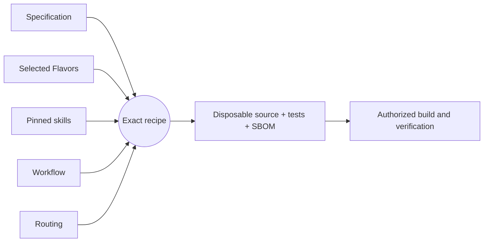

# Getting started

[Project guide](../README.md) → getting started

## What is this project?

LeRTX is being built as a digital-twin workspace for the LeRobot SO-101 leader
and follower. Its production targets are Linux and Windows with NVIDIA GPUs.
The desktop application combines a rendered USD scene, Newton physics, guided
physical-arm calibration and measured live RTX viewing. See the [runtime contract](../architecture/runtime.md).

## Installation

The retained prototype now has an isolated setup helper and desktop/Start Menu
launcher. From the repository, run `python desktop/manage.py setup`, then
`python desktop/manage.py install` and `python desktop/manage.py run`.
Python 3.11 (or `uv`) and a working NVIDIA driver are prerequisites; see
`desktop/README.md` for Linux ARM64 and packaging details.
There is no formally admitted graphical application release yet. Native SDK
integration and application execution are tracked by RENDER-001 and PORT-001 in
[active work](../roadmap/active-work.md). No service or hardware connection is
installed by the harness.

## Usage

### Native development application

The retained desktop application requires a provisioned Linux or Windows NVIDIA
GPU environment with the exact SDK dependencies in
`desktop/source/requirements.txt`. It does not install dependencies at launch.
See `desktop/README.md` for its source and acceptance status. From
`desktop/source`, using that environment's Python:

```sh
python main.py '[{"command":"launch"}]'
```

Use Open USD for an existing local scene, or explore the default workspace.
Play/Pause and Reset control Newton simulation; Save As preserves authored scene
edits, not transient simulated poses.

Grab an arm link in the viewport and drag right/up to increase its joint angle,
or left/down to decrease it. The selected link is outlined; targets stop at the
model's joint limits. Paused drags run a short physics preview and remain paused.
Disable following in Robot Controls to manipulate the follower independently.
Alt-left drag orbits the camera, middle drag pans, and the wheel zooms. Escape
cancels the remaining gesture. These controls operate only the simulated robots.

For milestone-three reconstruction:

1. Open Settings → Intelligence. Confirm the endpoint and model, then enter your
   API key. The key is session-only and starts blank; the app never reads the
   developer's credential file.
2. Review the reconstruction preset and output-token budget. The app reports
   incomplete responses rather than silently increasing your budget.
3. Choose Reconstruct Photo, select a PNG or JPEG and review its preview and
   destination. Upload and Reconstruct explicitly sends the resized,
   metadata-stripped image to that service.
4. Inspect and edit the resulting draft, then Save As a USD file. Reopening it
   preserves its unverified-dimensions warning. A reconstructed draft is not a
   measured collision model and must not be used to authorize robot motion.

Open **Help → Getting started** for the scrollable in-app guide.
The **Devices** panel enumerates USB adapters and records explicit leader/follower
roles. Use its role- and port-labelled **Calibrate** button to enter the wizard:
confirm support, capture the reference pose, sweep six joints, then Save. The
reference diagram and live RTX view stay together. **Save calibration to arm and
files** confirms final review without a checkbox; Back allows corrections.
If all six joints are captured but Save is disabled, follow the pinned requirement
(for example, return wrist twist into its normal coordinate range). Completed
captures are retained. Hardware controls also support importing existing calibration,
bounded manual motor commands and measured physical-to-virtual binding.
See [hardware controls](hardware.md) before the first physical connection.
Choose Open telemetry mock in Devices to exercise simulated leader/follower
connections, degree inputs, gripper percentage and frozen/stale streams without
hardware. This panel does not drive a rendered robot model yet.

### Original harness

The harness entry point accepts `{"command":"info"}` and reports
the planned integrations with `runtime_ready: false`. It does not connect to
robots. After a successful harness build, run:

```sh
litai build components/harness --target host
litai run components/harness --target host -- '[{"command":"info"}]'
```

The outer array is Literate AI's command-line argument envelope; the enclosed
object is the application's request.

---

## Development workflow

This project uses [Literate AI](https://github.com/NVIDIA-dev/literate-ai) to
keep specifications as durable authority and generate source, current tests, and a
CycloneDX source SBOM into a disposable workspace. The commands below are for
contributors, not end users.

Validate the project and inspect the exact recipe (planning does not invoke a
model or execute generated code):

```console
litai project validate
litai lock --check
litai plan samples/hello-component
```

Every non-empty initialized project begins with a portable hello Component. With an
authenticated coding CLI and the selected host toolchain, prove the complete local
lifecycle before changing it:

```console
litai rebuild samples/hello-component --project . \
  --allow-host-execution --update-receipt
```

The rebuild generates source and current tests from the specification, builds a
runnable artifact, runs both generated and independent acceptance tests, executes the
application, and commits the compact current passing receipt. Modify
`samples/hello-component/component.md` to begin the first application, or use
`litai init --empty` when no starter is wanted.

Invoke the `Execute:` command printed by rebuild with `{"name":"LitAI"}` as its one
argument. The known output is exactly
`{"greeting":"Hello, LitAI!","name":"LitAI"}`.



`+flavor` selects a variation and `-flavor` removes one. Explicit Component and
Flavor requirements outrank defaults, so `-bazel` removes the scaffold's Bazel
preference before prompt assembly. Read the [framework flow](framework-flow.md) before
adding a lifecycle driver that compiles or runs generated source, and use the
[project map](project-layout.md) to change the owning artifact.
